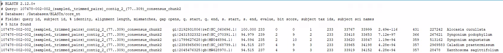
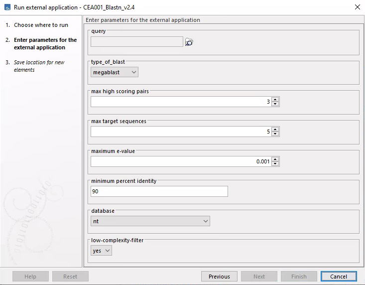

# CEA001_BLASTn

## 1.	Description
The Basic Local Alignment Search Tool (BLAST) is an algorithm used to 
compare (align) a DNA or protein sequence in a selected database. The 
search result reveals which related sequences are present in the chosen 
database (Morgulis et al. 2008).
CEA001_Blastn utilizes the blastn module of BLAST, including megablast, 
blastn, blastn-short, rmblastn, and dc-megablast. Multiple databases, such 
as a copy of the NCBI BLASTn database 'nt', can be used by this CEA as long 
as the location of the database is available.

## 2.	Version
CEA001_Blastn_v2.4

Contains: ncbi-blast-2.13.0+

## 3.	Front-end
### 3.1 	Input
CEA001_BLASTn expects a single or a list of nucleotide sequences in FASTA 
format. This is a text format with extensions such as *.fa, *.fas, *.fasta, 
etc., and it begins with a ">" sign indicating the start of the header line, 
followed by the sequence line(s) below it.

Example:

\>sample001_contig001_gen0001

ATGTCGACTGATCGGCTTCGACGATCGATGAGCTAGCTTAGGGA

CGACGATCGATGAGCTAGCTTAGATCGGCTTCGACGATCGATGA

CGACTGATCGGCGACTGATCGGAATCTCGATCGTGGCTAGAGAT

CCGCGCTTCGGATCGATAAATCGGGATCTTAGCTTAGGGCCTTA

CGATGAGCTAGCTTAGATCGGCTTCGACGGGATCTTAGCTTAGG

\>sample001_contig001_gen0002

ATGTCGACTGATCCGGCTTCGACGGGATCTTAGCTTAGCTTAGG

GACGATCGATGAGCTAGCTTAGATCGGCTTCGACGATCGATGAT

### 3.2 	Output
CEA001_BLASTn generates a tab-delimited text file that displays the following 
information for each sequence in a BLAST 7 output format(see Figure 1 for 
example output):

*   BLASTN version
*   Name BLASTed sequence
*   Used database
*   Titles of the columns in the hit table
*   Amount of hits found
*   Followed by the hit table

\

Figure 1: CEA001_blastn output example as tab-delimited text file.

### 3.3 	Adjustable parameters
BLAST has multiple parameters that are adjustable for the terminal user. In 
order to make these parameters adjustable in CLC Genomics Workbench, BLAST 
parameters can be linked to visual CLC items, like a dropdown menu. The 
parameters used for CEA001 are described in Table 1. Figure 2 illustrates how 
the CLC user views these parameters. 

Table 1: The parameters to be set for CEA001, as entered in the command 
(script), and how they appear for the user in CLC. The CLC input/output 
settings are what CLC fills in the background in the command for the parameters.

| Command line     | CLC                                                               | Description                                                                                                                                    | CLC portal Input/output settings                                                                           |
|------------------|-------------------------------------------------------------------|------------------------------------------------------------------------------------------------------------------------------------------------|------------------------------------------------------------------------------------------------------------|
| -query           | query                                                             | the input file                                                                                                                                 | User selected input data - (CLC data location) - FASTA(.fa/.fsa/.fasta)                                    |
| -task            | type_of_blast                                                     | Type of blast. the options are: blastn, blastn-short, rmblastn, megablast, dc-megablast                                                        | *Csv enumirator* - blastn,blastn-short,rmblastn,megablast,dc-megablast                                     |
| -max_hsps        | max high scoring pairs                                            | Maximum amount of high scoring segment pairs                                                                                                   | *Integer* - 3                                                                                              |
| -max_target_seqs | max target sequences                                              | Maximum amount of hits that you want returned per query. Default value = 5                                                                     | *Integer* - 5                                                                                              |
| -evalue          | maximum e-value                                                   | de maximum e-values waarde die hits mogen hebben. E-value is een mate van zekerheid dat de hit geen toevalligheid is. Standaardwaarde = 0.001  | *Double* – 0.001                                                                                           |
| -perc_identity   | minimum percent identity                                          | Percentage of similarity with the query. Default value: 90                                                                                     | *Integer* - 90                                                                                             |
| -db              | database                                                          | The user can select which database they want to use                                                                                            | *Csv enumirator* - Path to database, e.g. /MolbioDataDrive/BlastDatabases/BLASTn/nt                        |
| -dust            | low-complexity-filter                                             | If this is enabled then BLAST removes repeats from the analysis                                                                                | *Csv enumirator* - yes, no                                                                                 |
| -numthreads      |                                                                   | Amount of threads that the CLC job nodes can use                                                                                               | *Integer* - 16                                                                                             |
| -outfmt          |                                                                   | Indicates the format of the output                                                                                                             | "7 qseqid sseqid pident length mismatch gapopen qstart qend sstart send evalue bitscore staxids sscinames" |
| -out             | Saving window                                                     | Path where the output gets saved. Default file name is  BLASTn_result.txt                                                                      | Output file of CLC – flat text (.txt/.text) - BLASTn_result.txt                                            |

\

Figure 2: Display of parameters to be specified by the user.

## 4.	Back-end
### 4.1 	Terminal execution
`/path/to/blastn -query {query} -task {type_of_blast} -max_hsps {max high scoring pairs} -max_target_seqs {max target sequences} -evalue {maximum e-value} -perc_identity {minimum percent identity} -out {out} -db {database} -num_threads 16 -dust {low-complexity-filter} -outfmt "7 qseqid sseqid pident length mismatch gapopen qstart qend sstart send evalue bitscore staxids sscinames"`

### 4.2 	Requirements
For CEA001 to function properly the NCBI BLAST+ (ncbi-blast-2.13.0+) software
needs to be downloaded. The BLAST bin directory has to be added to PATH or
the full path location has to be added to the CLC portal (as shown above in
"terminal execution"). 

Databases, like the ncbi 'nt' database, have to be downloaded from 
ftp://ftp.ncbi.nlm.nih.gov/blast/db/. After downloading all nt.**.tar.gz files, 
they also need to be extracted. For taxonomic data, 
ftp://ftp.ncbi.nlm.nih.gov/blast/db/taxdb.tar.gz must be extracted in the same
directory.

Custom databases from a multi-fasta file can also be created by using the 
blastdb command of the BLAST software. For more information check BLAST 
documentation. 

### 4.3 	Script
Third-party C++ source code. Inaccessible for adjustments.

## 5 	References
A. Morgulis, G. Coulouris, Y. Raytselis, T.L. Madden, R. Agarwala & A.A. Schaffer (2008). Database Indexing for Production MegaBLAST Searches. Bioinformatics 24:1757-1764.

BLAST® Command Line Applications User Manual  	
https://www.ncbi.nlm.nih.gov/books/NBK279690/

BLAST® Help 	
https://www.ncbi.nlm.nih.gov/books/NBK1762/

NCBI FTP server  	
ftp://ftp.ncbi.nlm.nih.gov/blast/db/
