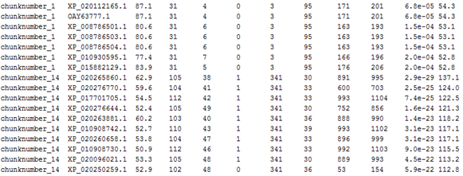
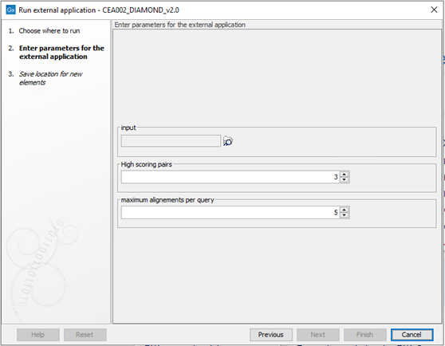

# CEA002_DIAMOND

## 1. Description

   Double Index Alignment Of Next-generation sequencing Data (DIAMOND) is an algorithm used to compare (align) a protein sequence in a selected database (Buchfink et al.). The search result shows which related sequences occur in the selected database.

   CEA002_DIAMOND uses the local BLASTp database ‘nr’. This database contains: Non-redundant protein sequences from GenPept, Swissprot, PIR, PDF, PDB and NCBI RefSeq. The database was downloaded from the NCBI FTP server.

## 2. Version

   CEA002_DIAMOND_v2.0 
   
   using diamond 2.0.13

## 3. Front-end

### 3.1 Input

   CEA002_DIAMOND expects a single or list of nucleotide sequences in fasta 
   format (*.fa, *.fas, *.fasta, etc.).

### 3.2 Output

   CEA002_DIAMOND produces a tab-delimited text file displaying 
   sequence-by-sequence information (Figure 1).
    
   
   _Figure 1: Example of a CAE002_DIAMOND output as tab-delimited text file._ 
   _Columns are as follows: query name, subject ID, % identity, alignment_ 
   _length, mismatches, gap opens, q. start, q. end, s. start, s. end,_ 
   _e-value, bit score, taxID._

### 3.3 Adjustable parameters

   The parameters used for CEA002 are described in Table 1 and the 
   visualization in CLC is shown in Figure 2.

   _Table 1: The parameters to be set for CEA002, how it entered on the command line (script) and how it is shown in CLC for the user (CLC). The CLC input/output settings are what CLC fills in the command for the parameters in the background._

| Command line | CLC | Description | CLC Input/Output Settings |
|----------------|-----|-------------|----------------------------|
| `-query`      | input | Input file | User-selected (CLC data location) – FASTA (.fa/.fsa/.fasta) |
| `--max-target-seqs` | Maximum alignments per query | Specify a number (default: 5) | Integer -5 |
| `--max-hsps` | High-scoring pairs | Specify a number (default: 3) | Integer -3 |
| `--taxonmap` | | Path to file used for taxonomy determination | `/MolbioDataDrive/Scripts/taxadatabase/prot.accession2taxid.gz` |
| `--outfmt` | | Defines the desired output table format | `6 qseqid sseqid pident length mismatch gapopen qstart qend sstart send evalue bitscore staxids` |
| `-out` | Storage window | Path where output is saved. Default filename: `blastx.txt` | Output file from CLC – Plain text (.txt/.text) – `blastx.txt` |

   
   _Figure 2: Display of user-specifiable parameters in CLC Genomics._

## 4. Back-end
### 4.1 Terminal Execution

   `/path/to/diamond blastx -d /path/to/nr -q {query} -o {out} -- max-target-seqs { Maximum alignements per query} –-max-hsps {High scoring pairs} --outfmt 6 qseqid sseqid pident length mismatch gapopen qstart qend sstart send evalue bitscore staxids`

### 4.2 Requirements

   For CEA002 to function properly the DIAMOND software has te be downloaded 
   and added to PATH, or the full path location has to be added to the CLC 
   portal (as shown above in "terminal execution"). 
   
   The NCBI 'nr' database can be downloaded from https://ftp.ncbi.nlm.nih.gov/blast/db/. 
   After downloading and extracting all nr.**.tar.gz files they should be 
   converted to .fasta format by using the following command:
   
   `blastdbcmd -entry all -db /location/to/DIAMOND_database/nr -out /Location/to/DIAMOND_database/nr.fasta`
   
   Furthermore, the fasta file should be indexed. For this, DIAMOND needs a taxonomic database to add tax id to the results. 
   
   `wget https://ftp.ncbi.nlm.nih.gov/pub/taxonomy/accession2taxid/prot.accession2taxid.FULL.gz`
   &
   `diamond_v2.0.13 makedb --in nr.fasta --taxonmap prot.accession2taxid.FULL.gz --db nr --threads 8`
   
   At the end the diamond makedb creates a dmnd file, that confirms indexing
   was successful. 

   
### 4.3 Script

   Third-party C++ source code. Inaccessible for modification.

## 5. References

Buchfink B., Xie C. & Huson D.H. (2015) Fast and sensitive protein alignment 
using DIAMOND. Nature Methods 12:59-60. 

The DIAMOND protein aligner 
- [http://www.diamondsearch.org](http://www.diamondsearch.org)
   
DIAMOND github page
https://github.com/bbuchfink/diamond

DIAMOND user manual
http://ab.inf.uni-tuebingen.de/data/software/diamond/download/public/manual.pdf

