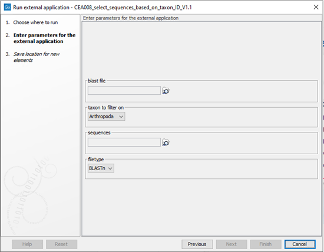

# CEA008_select_sequences_based_on_taxon_ID


## 1. Description

CEA008_select_sequences_based_on_taxon_ID reads a BLASTn or BLASTx hit table. If the top hit of a query has a taxID that is present in a predefined taxID list, the associated sequence of the query will be printed in a FASTA file. Resulting in a taxID selected (multi-) FASTA file of query sequences.

## 2. version

CEA008_select_sequences_based_on_taxon_ID_v1.2

## 3. Front-end

### 3.1 Input
CEA008_select_sequences_based_on_taxon_ID expects a hit table obtained from BLASTn or DIAMOND and query sequences in a (multi-)fasta file, for example assembly sequences.
### 3.2 Output
CEA008 creates a (multi-)fasta file with all query sequences that have a taxID matching the selected taxID list.
### 3.3 Configurable Parameters
The parameters used for CEA008 are described in Table 1. Figure 1 shows how the CLC user sees the parameters.

_Table 1: Configurable parameters for CEA008, as entered in the command (script), and how it appears in CLC for the user (CLC). The CLC input/output settings represent what CLC fills in the command for the parameters in the background._

|     script    |     CLC                   |     Description                                                    |     CLC Input/output settings                                                                                                                                                                                                                                                                                                                                                                                                      |
|---------------|---------------------------|--------------------------------------------------------------------|------------------------------------------------------------------------------------------------------------------------------------------------------------------------------------------------------------------------------------------------------------------------------------------------------------------------------------------------------------------------------------------------------------------------------------|
|     -t        |     Taxon to filter on    |     Taxa   list used to filter query sequences.                    |     CSV enumirator - /home/molbio/scripts/Arhropoda.txt,/home/molbio/scripts/Bacteria.txt,/home/molbio/scripts/Fungi.txt,/home/molbio/scripts/Liberbacter.txt,/home/molbio/scripts/Nematoda.txt,/home/molbio/scripts/Oomycota.txt,/home/molbio/scripts/Phytoplasma.txt,/home/molbio/scripts/Viroids.txt,/home/molbio/scripts/Viruses.txt   - Arhropoda,Bacteria,Fungi,Liberbacter,Nematoda,Oomycota,Phytoplasma,Viroids,Viruses    |
|     -b        |     blast file            |     File   created using      CEA001_BLASTn   or CEA002_DIAMOND    |     User   selected input data (CLC data location) – Plain text(.txt/.text)                                                                                                                                                                                                                                                                                                                                                        |
|     -c        |     sequences             |     File   used to get the query sequences.                        |     User   selected input data (CLC data location) – FASTA(.fa/.fsa/.fasa)                                                                                                                                                                                                                                                                                                                                                         |
|     -y        |     filetype              |     BLASTn or BLASTx                                               |     User   selected dropdown menu                                                                                                                                                                                                                                                                                                                                                                                                  |
|     -u        |     Saving window         |     Path   to where the output file should be saved.               |     Output   of CLC      File   name ends with _selected_sequences.fasta                                                                                                                                                                                                                                                                                                                                                           |


\
_Figure 1: Example display of how the CLC user sees the parameters._

## 4. Back-end

### 4.1 Terminal execution
```console
/path/to/CEA008_select_sequences_based_on_taxon_ID_v1.1.py -b {blast file} -t {taxon to filter on} -c {sequences} -u {sequences} -y {filetype}
```
### 4.2 Requirements
A NCBI taxa list is necessary. Furthermore script uses Python 3 and BioPython v1.74. could work with newer versions, but is not tested
### 4.3 Script
First-party Python script.

