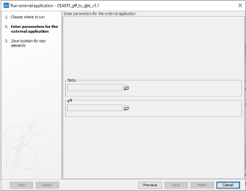

# CEA011_gff_to_gbk

## 1.	Description
CEA011 can be used to convert the GFF annotation file format with a FASTA reference sequence to a GenBank annotation file. The advantage of this conversion is that a GenBank annotation file embeds the reference sequence and is more widely accepted as input by various bio-data analysis tools.

## 2.	Version
CEA011_gff_to_gbk_v1.0

## 3.	Front-end
### 3.1 	Input
A FASTA sequence file with its corresponding GFF annotation file.  

### 3.2 	Output
An annotated GenBank file with sequence and annotation data.

### 3.3 	In te stellen parameters
The parameters used for CEA011 are described in Table 1.

Table 1: The configurable parameters for CEA011, as entered in the command line (script) and how they appear to the user in CLC. The CLC input/output settings represent what CLC fills in the command for the parameters in the background.
| script | CLC           | Description                      | CLC Input/output settings                            |
|--------|---------------|-----------------------------------|----------------------------------------------------------|
| {1}    | fasta         | Fasta input file to import | User-selected input data FASTA (.fa/.fsa/.fasta)         |
| {2}    | gff           | GFF input annotation file       | User-selected input data Plain text (.txt/.text)         |
| {3}    | Saving window | Genbank output annotation file    | Genbank (.gbk/.gb/.gp/.gbff) Output file default: “_gbk” |

\
Figure 1: Parameters to be specified by the user.

## 4.	Back-end
### 4.1 	Terminal execution
Bash Commando:

>/bin/bash -c '/path/to/gff_to_gbk {fasta} {gff} {output_dir}'
	
### 4.2 	Requirements
A conda installation to create a conda environment with a Python 2.7 installation, including BCBIO and Biopython v1.73. The decision has been made to use the same conda environment as used for CEA009:

>conda create -n MITOS -c bioconda -c conda-forge -c defaults 'python=2.7' 'biopython=1.73' 'bcbio-gff=0.6.6' 'r-base=3.5.1'

This command creates a conda environment named "MITOS" with Python 2.7, Biopython v1.73, BCBIO GFF v0.6.6, and R v3.5.1. The specified channels are bioconda, conda-forge, and defaults.

### 4.3 	Script
Create a first-party Bash script that activates a Conda environment and then runs a first-party Python script. These scripts and any earlier versions can be found on our Labcloud molbiostorage drive: X:\3.Scripts_pipelines\Scripts\CEA011\

## 5	Changes compared to the previous version:
1. Replaced Figure 1 to ensure the version number is correct.
2. Modified terminal execution. It no longer calls the Python script but calls the Bash script.
3. Updated requirements in section 4.2. Now, a Conda environment is required to use the CEA.
4. Adjusted section 4.3 to reflect the addition of a Bash script.

## 6.		Research and validation
2020.molbio.01-011 CEA011_gff_to_gbk \
CEA011 is included in: 2020.molbio.01-009 CEA009_mitos_annotation \
2019.molbio.01-007 2019.molbio.007 Validation Nematode pipeline

## 7. 	References
Original basis of the script obtained from: https://github.com/chapmanb/bcbb/blob/master/gff/Scripts/gff/gff_to_genbank.py