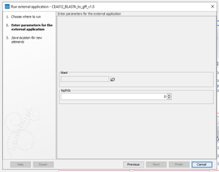

# CEA012_BLASTn_to_gff

## 1.	Description
CEA012 can be used to convert the top hits per query from a BLAST output text file (in outfmt 7 format) to a GFF file. The advantage of this is that in Geneious, the location of these sequences relative to a part/contig of the genome can be visually examined.

## 2.	Version
CEA012_BLASTn_to_gff_v1.0

## 3.	Front-end
### 3.1 	Input
A BLAST output text file in outfmt 7 format.

### 3.2 	Output
An annotated gff file

### 3.3 	Adjustable parameters

The parameters used for CEA012 are described in Table 1.

Table 1: The parameters to be set for CEA012, as entered in the command (script), and how it appears for the user in CLC (CLC). The CLC input/output settings are what CLC fills in the command for the parameters in the background.
|script|CLC|omschrijving|CLC Input/output instellingen|
|:----|:----|:----|:----|
|{1}|blast|Fasta input file om te importeren|User-selected input data, Plain text (.txt/.text)|
|{2}|tophits|Integer om aan te geven hoeveel tophits per query in de output annotatie moeten komen.|Integer|
|{3}|output|Gff output annotation file|Output file from CLC, Plain text (.txt/.text)|

\
Figure 1: Representation of parameters to be specified by the user.

## 4.	Back-end
### 4.1 	Terminal execution

Command line:
python3 /path/to/CEA012_BLASTn_to_gff.py {blast} {tophits} {output}	

### 4.2 	Requirements

Argparse package in python 3

### 4.3 	Script

First party python script. Dit scripts en eventueel eerdere versies kunnen gevonden worden in onze Labcloud molbiostorage drive: “T:\PD\NIVIP\Molbio\Onderzoek\2022\2022.molbio.001 Maatwerkdiagnostiek\2022.molbio.001-16 CEA012 BLAST to gff” en op de gitlab bij CEA012

## 5.		Research and validation

2022.molbio.001-016 CEA012_BLASTn_to_gff
	
## 6. 	References
N/A